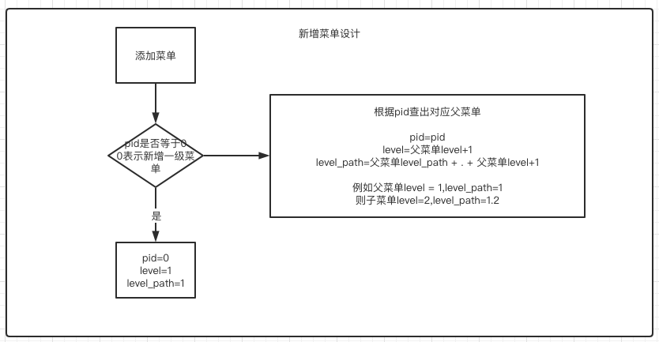

[TOC]

# 介绍

部分功能逻辑的设计留存

# 新增菜单



# 菜单展示JSON

```json

[
    {
        "id": 1,
        "name": "用户管理",
        "pid": 0,
        "level": 1,
        "path": "",
        "icon": "",
        "children": [
            {
                "id": 3,
                "name": "修改用户",
                "pid": 1,
                "level": 2,
                "path": "/user/update",
                "icon": "",
                "children": []
            },
            {
                "id": 2,
                "name": "新增用户",
                "pid": 1,
                "level": 2,
                "path": "/user/add",
                "icon": "",
                "children": []
            }
        ]
    },
    {
        "id": 4,
        "name": "菜单管理",
        "pid": 0,
        "level": 1,
        "path": "",
        "icon": "",
        "children": [
            {
                "id": 5,
                "name": "新增菜单",
                "pid": 4,
                "level": 1,
                "path": "/user/add",
                "icon": "",
                "children": []
            },
            {
                "id": 7,
                "name": "删除菜单",
                "pid": 4,
                "level": 2,
                "path": "/user/delete",
                "icon": "",
                "children": []
            },
            {
                "id": 6,
                "name": "修改菜单",
                "pid": 4,
                "level": 2,
                "path": "/user/update",
                "icon": "",
                "children": []
            }
        ]
    },
    {
        "id": 8,
        "name": "系统管理",
        "pid": 0,
        "level": 1,
        "path": "",
        "icon": "",
        "children": [
            {
                "id": 9,
                "name": "代码生成",
                "pid": 8,
                "level": 1,
                "path": "/user/add",
                "icon": "",
                "children": [
                    {
                        "id": 10,
                        "name": "工程生成",
                        "pid": 9,
                        "level": 2,
                        "path": "/user/update",
                        "icon": "",
                        "children": []
                    },
                    {
                        "id": 11,
                        "name": "实体生成",
                        "pid": 9,
                        "level": 2,
                        "path": "/user/delete",
                        "icon": "",
                        "children": []
                    }
                ]
            },
            {
                "id": 12,
                "name": "日志管理",
                "pid": 8,
                "level": 1,
                "path": "/user/add",
                "icon": "",
                "children": [
                    {
                        "id": 13,
                        "name": "日志查看",
                        "pid": 12,
                        "level": 2,
                        "path": "/user/update",
                        "icon": "",
                        "children": []
                    }
                ]
            }
        ]
    }
]
```